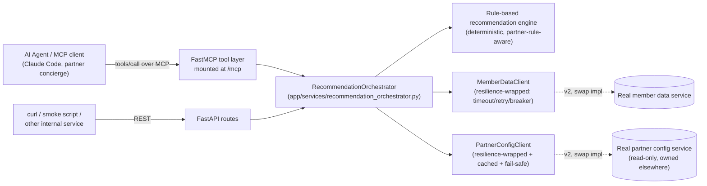
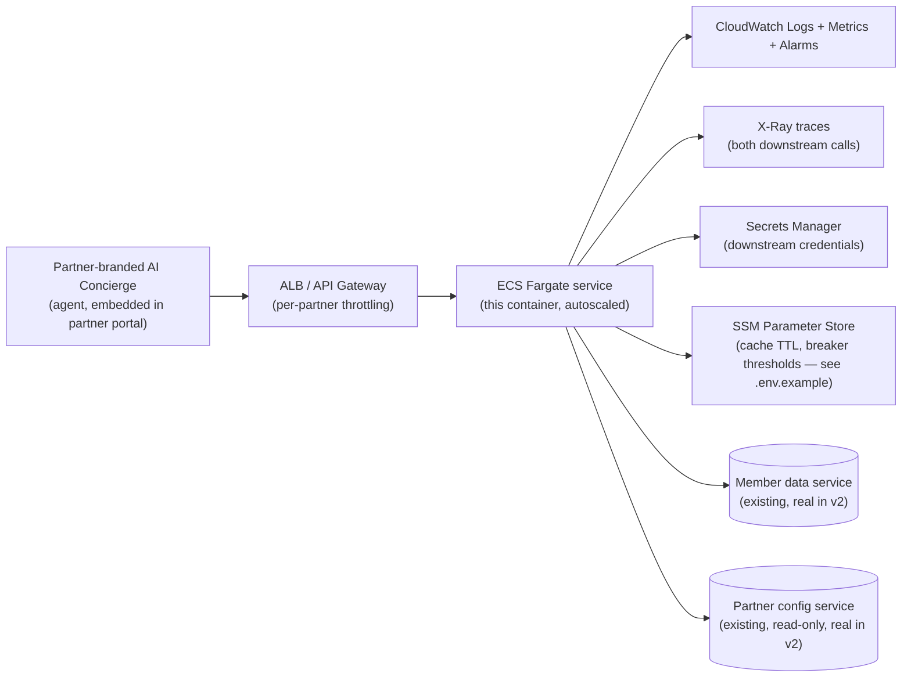

# Agentic Travel Recommendations API

An internal service that lets AI agents (via MCP) pull a member's loyalty
tier and travel history, and get back personalized, **partner-rule-compliant**
travel recommendations — the backend for a partner-embeddable "AI Concierge."

Built as a 4-week, single-engineer v1. Two mocked upstreams stand in for
services this team doesn't own: the **member data service** (read-only) and
the **partner configuration service** (read-only, hard constraint — see
`app/mocks/`). Everything else here — the rule engine, the resilience layer,
the MCP tool surface — is real, runnable code, not a sketch.

```
git clone / cd into this repo
uv venv .venv && uv pip install -p .venv -e ".[dev]"
.venv/bin/pytest -q                                   # 24 tests, ~0.7s
.venv/bin/uvicorn app.main:app --port 8000             # run it
.venv/bin/python scripts/mcp_smoke_test.py              # exercise it over MCP
```

## Contents

- [Section A — Architecture & Trade-offs](#section-a--architecture--trade-offs)
- [MCP tool surface](#mcp-tool-surface)
- [Partner rule enforcement](#partner-rule-enforcement)
- [Reliability & on-call design](#reliability--on-call-design)
- [Section B — Production Readiness & Incident Response](#section-b--production-readiness--incident-response)
- [AWS deployment mapping](#aws-deployment-mapping-existing-infrastructure-only)
- [Four-week delivery plan](#four-week-delivery-plan)
- [What's explicitly out of scope](#whats-explicitly-out-of-scope-for-v1)
- [Running & verifying](#running--verifying)
- [Section C — AI Usage Log](#section-c--ai-usage-log-mandatory)

## Section A — Architecture & Trade-offs

### Architecture Overview

One process, two transports, one business-logic core. The MCP layer and the
REST layer are both thin wrappers around the same `RecommendationOrchestrator`
— a rule fix or a resilience fix only has to happen once, and the two
transports can never silently drift apart in behavior.



Key files:
- [`app/services/recommendation_orchestrator.py`](app/services/recommendation_orchestrator.py) — the one place request flow lives
- [`app/services/recommendation_engine.py`](app/services/recommendation_engine.py) — pure, deterministic ranking + rule enforcement
- [`app/services/member_client.py`](app/services/member_client.py) / [`partner_config_client.py`](app/services/partner_config_client.py) — the swappable interfaces over each mocked upstream
- [`app/mcp_server.py`](app/mcp_server.py) / [`app/api/routes.py`](app/api/routes.py) — the two transports

**Swapping a mock for the real service later is a one-class change**: write
e.g. `HttpMemberDataClient(MemberDataClient)` that calls the real API, wire
it in `app/dependencies.py` instead of `MockMemberDataClient`. Nothing in
the orchestrator, engine, or either transport changes.

### Design Trade-offs

**1. Deterministic rule-based ranking instead of an ML- or LLM-scored
ranker.** A learned ranker would likely surface subtler affinities, but it
turns "why did member X see offer Y" into a question that needs a model
re-run — and possibly non-reproducible output — to answer, which is a bad
property for a service the team is on call for. The rule-based engine
(`recommendation_engine.py`) is deterministic and cheap to unit test
exhaustively. Trade-off accepted: less sophisticated personalization in v1,
in exchange for something on-call can fully explain from the
`applied_rules` field alone, with a clean seam to swap in a scoring model
later without touching rule enforcement.

**2. One shared process for both MCP and REST, instead of a separate MCP
gateway service.** Running FastMCP and FastAPI in the same ASGI app means
one deploy pipeline and one set of circuit breakers/caches — MCP and REST
callers see identical downstream health, and there's less v1 infrastructure
to stand up in four weeks. The cost: both transports share a failure domain
and scale together, so a load spike on one affects latency on the other.
Accepted for v1 given the expected traffic; splitting them into two ECS
services in front of the same client interfaces is a mechanical change
later if their load profiles diverge.

### Handling Partner Configuration Changes

If a partner changes their `max_recommendations` cap or adds a new
`excluded_categories` entry (for a category this service already models),
**no code change or deploy is required.** `PartnerConfig` is a generic
schema (`max_recommendations: int | None`, `excluded_categories:
list[BookingType]`), so `build_recommendations()` already handles whatever
values the partner config service returns. Propagation is bounded by the
cache — up to `ARRIVIA_PARTNER_CONFIG_CACHE_TTL_SECONDS` (5 min default) —
since we deliberately cache to avoid hammering a service we don't own on
every request.

Two things *would* require a change:
- **A brand-new booking-type category** (e.g. "insurance") not already in
  the `BookingType` enum — needs a code change (enum, offers catalog,
  engine) and a deploy, since an exclusion list can only reference
  categories this service already models. A real limitation of a closed
  enum, worth flagging rather than hiding.
- **An urgent, can't-wait-for-the-TTL change** (e.g. a compliance-driven
  exclusion) — v1 has no cache-invalidation path (no webhook, no admin
  flush endpoint), so it would sit behind the TTL. Known gap; a v2 fix is
  either an admin cache-bust endpoint or subscribing to a change
  notification if the partner config service ever offers one.

## MCP tool surface

Three tools, all read-only by design:

| Tool | Purpose |
|---|---|
| `get_member_travel_profile(member_id)` | Loyalty tier, partner, last 5 bookings |
| `get_travel_recommendations(member_id, session_id?)` | The main tool — partner-rule-enforced, ranked recommendations with rationale |
| `list_partner_recommendation_rules(partner_id)` | The active rules for a partner, so an agent can explain *why* a list was capped or missing a category |

**No write/booking tools in v1.** A concierge agent that can only read and
recommend has a small blast radius if it's prompt-injected by untrusted
content in a chat, or simply hallucinates. "Book this for me" is a
deliberate v2 decision that needs its own authz model — see
[What's out of scope](#whats-explicitly-out-of-scope-for-v1).

Discover and call the tools yourself:

```bash
.venv/bin/uvicorn app.main:app --port 8000     # terminal 1
.venv/bin/python scripts/mcp_smoke_test.py     # terminal 2 — see below for sample output
```

## Partner rule enforcement

**The load-bearing rule: `partner_id` is always derived from the member
record returned by the member service — never accepted from caller input.**
If a client could pass `partner_id` directly, it could select a more
permissive rule set than the member's actual partner allows — a
multi-tenancy break, not just a bug. Every code path (`recommendation_orchestrator.py`)
looks up the member first and uses `member.partner_id` from there on.

Given a member and their partner's config, `build_recommendations()`
([recommendation_engine.py](app/services/recommendation_engine.py)):
1. drops any offer in the partner's `excluded_categories`,
2. drops any offer above the member's loyalty tier,
3. drops destinations the member has already booked,
4. ranks the rest by recency-weighted booking-type affinity (deterministic,
   no randomness — reproducible when debugging a partner complaint),
5. truncates to the partner's `max_recommendations` (`null` = unlimited).

The response always includes `applied_rules` (what was excluded, whether it
was capped, whether a fallback config was used) so both the REST caller and
the agent can explain the result without re-deriving it.

Sample partners in the mock data (`app/mocks/partner_configs.py`), chosen to
exercise every branch:

| partner_id | cap | excludes | member(s) to try |
|---|---|---|---|
| `suntrust-rewards` | 3 | — | `m-1001`, `m-1002`, `m-1008` (no history) |
| `globalfirst-travel` | unlimited | cruise | `m-1003` (history includes a past cruise — still filtered) |
| `meridian-points` | 1 | cruise, package | `m-1005` |
| `voyage-elite` | unlimited | — | `m-1006` |
| *(unregistered)* | — | — | `m-1007` → exercises the fail-safe fallback below |

## Reliability & on-call design

This team owns this service in production. Every choice below is about
what happens when something *else* breaks, and what on-call sees at 2am.

**Fail-safe, not fail-open, on partner rules.** The one hard constraint on
this project is "respect partner config even if suboptimal — you can't
modify it, only read it." That principle has to extend to *outages*: if we
can't reach the partner config service, or it has no record for a
`partner_id`, we must not guess permissive. `PartnerConfigClient`
(`app/services/partner_config_client.py`) resolves in this order:
1. an unexpired cached value (TTL: `ARRIVIA_PARTNER_CONFIG_CACHE_TTL_SECONDS`, default 5 min),
2. a *stale* cached value, if within `ARRIVIA_PARTNER_CONFIG_MAX_STALENESS_SECONDS` (default 15 min) — survives brief blips without over-restricting,
3. otherwise the strictest fail-safe default (`max_recommendations=1`, cruises
   and packages excluded) — never unlimited, never uncapped.

Every response built on a fallback config carries `degraded: true` so
nobody mistakes a fail-safe guess for an authoritative partner rule.

**Member service down → degrade, don't fail the request.** No member record
means no personalization signal, but the "AI Concierge" experience is worse
if it just errors. `build_generic_recommendations()` returns partner-rule-
compliant popular picks (still filtered by whatever partner rules can be
resolved) with `degraded: true, degraded_reason: "member_service_unavailable"`
— the agent can be honest with the end user about reduced personalization
instead of silently presenting a guess as tailored advice.

**Timeout + bounded retry + circuit breaker per dependency**
(`app/services/resilience.py`). A flaky partner-config lookup can't cascade
into member-data calls or exhaust the event loop retrying a dependency
that's clearly down. Business-logic exceptions (e.g. "member not found")
are explicitly marked non-retryable — they're a valid answer from a healthy
dependency and must never trip the breaker.

**`/health` vs `/ready`, deliberately different.** `/health` is liveness
only — it makes no downstream calls. A "deep" health check that pings
member data or partner config would let *their* slowness cascade into every
ECS task getting marked unhealthy and cycled simultaneously. `/ready`
exposes circuit breaker state instead, which is what alarms should actually
watch.

**Structured JSON logs**, every line carrying `request_id`, `partner_id`,
and a *hashed* `member_id` (`app/logging_config.py`) — no raw member
identifiers or PII in logs, but every line is still greppable by the three
things on-call actually searches by.

**Alarms on symptoms, not causes**: error rate, p99 latency, and
"breaker-open duration" per dependency — not "member service returned a
500," which on-call can't act on differently than the symptom anyway.

You can reproduce the failure modes locally:

```bash
# Member service "down" 100% of the time
ARRIVIA_MOCK_MEMBER_SERVICE_FAILURE_RATE=1.0 .venv/bin/uvicorn app.main:app --port 8000

curl localhost:8000/v1/recommendations/m-1001   # -> 200, degraded: true, generic picks
for i in 1 2 3 4 5; do curl -s -o /dev/null localhost:8000/v1/recommendations/m-1001; done
curl localhost:8000/ready                        # -> 503 once the breaker opens
```

That exact sequence was run against this codebase during development — the
breaker opened on the 5th consecutive failure (the configured threshold)
and `/ready` flipped to 503 immediately after, with `/health` staying `200`
throughout.

## Section B — Production Readiness & Incident Response

### Incident Runbook Entry: cruise offers shown despite a partner exclusion

**Symptom:** a member on a partner whose config excludes cruises reports
seeing a cruise recommendation from the AI Concierge.

**Diagnose**
1. Get the member's `member_id` and, from the report or
   `GET /v1/members/{member_id}`, their `partner_id`.
2. Call `GET /v1/partners/{partner_id}/rules` (or the
   `list_partner_recommendation_rules` MCP tool) directly against
   production — confirm what this service currently believes the partner's
   rules are, and check `is_fallback`.
3. Search CloudWatch Logs Insights for that `partner_id` around the report
   time for `partner_config_fallback_applied` / `partner_config_serving_stale`
   — if the partner recently changed their config and we were still inside
   the cache TTL/staleness window, this is expected transient behavior, not
   a bug.
4. Reproduce directly: call `get_travel_recommendations` for the member and
   inspect `applied_rules.excluded_categories` in the response.

**Confirm root cause**
- `excluded_categories` correctly includes `"cruise"` but a cruise offer is
  still in `recommendations` → the bug is in the filter step of
  `build_recommendations()` (`app/services/recommendation_engine.py`) —
  likely a miscategorized offer in the catalog or a comparison bug.
- `excluded_categories` does **not** include `"cruise"` → the bug is
  upstream of the engine: either the partner config service itself doesn't
  have the exclusion set (escalate to its owners — we can only read it, not
  fix it there), or our client is serving a stale/fallback config
  incorrectly. Pull the exact `request_id` from the member's session log
  line to see precisely which config was in effect at that moment.

**Resolve**
- Engine bug: hotfix the filter, add a regression test mirroring
  `test_excluded_category_never_appears` for that partner, deploy.
- Stale-cache related: temporarily lower
  `ARRIVIA_PARTNER_CONFIG_CACHE_TTL_SECONDS` via SSM — no deploy needed.
- Upstream data issue: this service can't fix it directly (read-only
  constraint) — escalate to the partner config service owners, and confirm
  we're at least *surfacing* the discrepancy accurately in the meantime.
- Post-incident: verify/add a CloudWatch alarm on the
  `partner_config_fallback_applied` / `serving_stale` rate for that partner
  so this pages before a member notices next time.

### Part B2 - Required Reasoning Question

Describe a scenario where an AI coding assistant would give you a plausible but incorrect answer for this type of problem, building an API that enforces partner-specific business rules. Explain specifically how you would catch the error and what you would check before acting on it.

**Scenario: schema presence mistaken for actual enforcement.**

Suppose in v2 I ask an assistant to add a fourth MCP tool,
`get_similar_members_offers`, say, a "what did similar members book"
tool, and prompt it with something like "make sure this respects
partner rules like the other tools do." A very plausible failure mode:
the assistant adds `partner_id` and `excluded_categories` fields to the
tool's response schema (`models/schemas.py`), maybe even fetches the
`PartnerConfig` and includes it in the payload for "transparency," and
returns offers that *look* correctly scoped in a quick manual test
because the test member's excluded category happens not to collide with
what a similarity search would surface. It never actually calls
`build_recommendations()`, the one function that does cap enforcement,
category exclusion, and tier-gating (`app/services/
recommendation_engine.py`). The code compiles, the response shape matches
every other tool, a docstring says "partner-rule-compliant," and a
shallow read of the diff looks like the feature was done correctly. The
rule enforcement is present in the *data model*, not in the *code path*, 
and that distinction is easy for both an LLM and a reviewer skimming a
diff to miss, because the response object contains the right fields
either way.

This is exactly the seam this codebase already narrows deliberately:
`recommendation_orchestrator.py` is written as the *one* place that
derives `partner_id` and hands the member + partner config to the engine,
specifically so a second, parallel enforcement path doesn't get
hand-rolled later. But that only holds as an invariant if every new tool
is actually routed through the orchestrator, nothing in the type system
stops a new tool from calling the offers catalog or a raw member client
directly and building its own response.

**How I'd catch it:**
- Never trust "the response has an `applied_rules` field" as evidence of
  enforcement. Grep the diff for a call into `build_recommendations` /
  `build_generic_recommendations` (or, post-refactor, the orchestrator).
  If a new code path touches offers/recommendations without going through
  that function, that's the review-blocking finding regardless of how
  correct the output looks.
- Write the adversarial test first, not after: construct a member whose
  history/similar-members set is *only* satisfiable by an excluded
  category or an over-cap count for their partner (mirroring
  `test_excluded_category_never_appears` and the cap tests in
  `tests/test_recommendation_engine.py`), and assert on the actual
  returned offers, not on the presence of a rules field in the response.
  A schema-only bug passes every test that only checks shape.
- Check it against a partner with a *non-default*, maximally restrictive
  config (`meridian-points`: cap 1, cruise + package excluded) rather
  than the permissive one (`voyage-elite`), a permissive partner won't
  expose a missing-enforcement bug because nothing gets filtered either
  way.
- Ask "what happens if this runs against `voyage-elite` first and
  `meridian-points` second", an assistant hand-rolling its own filtering
  logic instead of reusing the engine is exactly where partner-config
  values leak or get cached/reused incorrectly across requests, which
  the existing partner-fail-safe tests are designed to catch for the
  *existing* tools but wouldn't automatically cover a new one.

## AWS deployment mapping (existing infrastructure only)

No new infrastructure platform. Everything here is a container behind the
same AWS building blocks arrivia already runs on.



Docker image → ECR → ECS Fargate task, same CI/CD path other arrivia
services already use. `Dockerfile` runs as a non-root user and defines a
`HEALTHCHECK` against `/health` for the container-level check; ALB/ECS
target group health checks point at the same path.

## Four-week delivery plan

**Week 1 — Foundation.** Service skeleton, both mock clients behind
interfaces, data models, `/health` + `/ready`, a rule-based recommendation
engine *without* partner rules yet, unit tests, `Dockerfile`.

**Week 2 — Partner rule enforcement.** Cap + category exclusion, partner
config caching + fail-safe fallback, `partner_id`-from-member enforcement,
edge-case tests (unregistered partner, partner service down).

**Week 3 — MCP layer.** FastMCP tool definitions wrapping the same service
layer, tool schemas for discovery, timeout/retry/circuit breaker around both
mocked clients, structured logging, local smoke testing via a real MCP
client.

**Week 4 — Production hardening.** CloudWatch metrics/alarms, X-Ray hooks,
chaos-style failure testing (this README's reliability section), on-call
runbook, security pass (no PII in logs, least-privilege IAM sketch),
README/demo polish.

**Ships at the end of week 4:** REST + MCP recommendation endpoint over two
mocked upstreams, full partner rule enforcement, deterministic rule-based
ranking with rationale, timeout/retry/breaker/cache/fallback resilience,
structured logs, containerized for ECS Fargate, unit + integration tests,
an on-call-ready failure-mode story.

## What's explicitly out of scope for v1

Deferred on purpose, not by oversight:

- **Real integrations** replacing the two mocks (this is the literal next
  step in v2 — the interfaces are already shaped for it)
- **ML-based ranking** — the current engine is deliberately simple,
  deterministic, and explainable; a model can sit behind the same
  `build_recommendations()` boundary later without touching rule enforcement
- **Per-partner branded copy / white-label theming** of recommendation text
- **Click-through / feedback loop** to improve future ranking
- **Partner-portal auth (OAuth/API keys) in front of this service** — v1
  assumes it sits behind arrivia's existing internal gateway / service-to-
  service auth, not exposed directly to partner front-ends
- **Any write/booking MCP tools** — read-only is a deliberate v1 boundary,
  see [MCP tool surface](#mcp-tool-surface)
- Multi-region/active-active, an admin UI for partner config, A/B testing

## Running & verifying

```bash
# install
uv venv .venv && uv pip install -p .venv -e ".[dev]"
# (or: python3 -m venv .venv && .venv/bin/pip install -e ".[dev]")

# unit + integration tests (engine rules, resilience/breaker behavior,
# partner fail-safe fallback, MCP tool discovery + invocation)
.venv/bin/pytest -q

# run the service
.venv/bin/uvicorn app.main:app --port 8000

# REST, in another shell
curl localhost:8000/health
curl localhost:8000/v1/recommendations/m-1001

# MCP, in another shell — discovers all 3 tools and walks through every
# partner-rule scenario in the mock data (capped, unlimited+excluded,
# fail-safe fallback, cold-start, unknown member)
.venv/bin/python scripts/mcp_smoke_test.py

# or open the browser demo (same REST endpoints, visually)
open http://localhost:8000/ui/
```

**Browser demo** (`app/static/index.html`, served by FastAPI at `/ui`,
`/` redirects there): pick one of the 8 mock members and it walks the same
three calls a partner concierge agent would make — `GET /v1/members/{id}`
→ `GET /v1/partners/{id}/rules` → `GET /v1/recommendations/{id}` — showing
the fetched partner rules, the returned recommendations, and the
`applied_rules` metadata that explains them. Pick `m-1003` to see cruise
history excluded by `globalfirst-travel`'s rules, or `m-1007` to see the
fail-safe fallback (unregistered partner → cap 1, cruise+package excluded,
`degraded: true`) rendered live. Demo-only, not part of the graded API
surface — vanilla HTML/JS, no build step, no framework.

Test coverage (`tests/`): recommendation-engine rule enforcement
(`test_recommendation_engine.py`), the circuit breaker and retry semantics
in isolation (`test_resilience.py`), the partner fail-safe/caching policy
(`test_partner_rules.py`), and MCP tool discovery + invocation end to end
through an in-process session (`test_mcp_tools.py`).

## Section C — AI Usage Log (Mandatory)

This service was built with Claude Code in an agentic loop. Three
representative interactions, in the order they happened:

**1. Architecture & implementation plan**
- *Asked:* to design the overall service — MCP + REST for a
  partner-rule-constrained recommendation API, two mocked upstreams, scoped
  to four weeks, targeting AWS.
- *Got:* a plan proposing a shared FastAPI+FastMCP process, an
  interface-based split between the two mocked clients, a fail-safe-on-outage
  policy for partner config, and a week-by-week delivery breakdown.
- *Kept / changed:* kept the structure almost entirely — it matched how I'd
  have scoped it myself. The one thing I pushed on explicitly was making
  sure the "respect partner rules even if suboptimal" constraint was read to
  also cover *outages* (fail strict, not fail open) — that implication is
  easy for a plan to get backwards by default, and it became the single
  most important decision in the codebase (see
  [Reliability & on-call design](#reliability--on-call-design)).

**2. Mounting the MCP server under FastAPI**
- *Asked:* to wire the MCP tool server and the REST API into one ASGI app.
- *Got:* `app.mount("/mcp", mcp.streamable_http_app())` — a reasonable-
  looking pattern based on typical FastMCP usage.
- *Rejected / changed:* it didn't work. `streamable_http_app()` serves at
  its own internal `/mcp` path by default, so mounting it *at* `/mcp`
  produced `/mcp/mcp`, and every tool call 404'd. This was caught by
  actually running the server and connecting a real MCP client, not by
  trusting that the code looked right — the fix was setting
  `streamable_http_path="/"` on the FastMCP instance before mounting. Kept
  the fix; the broader lesson was procedural — for a new SDK integration,
  "it runs without errors" isn't the bar, a live client round-trip is.

**3. Test suite for partner-config caching**
- *Asked:* for pytest coverage of the partner-config cache/fallback policy,
  including "a known partner's config is cached across calls."
- *Got:* a test that monkeypatches `lookup_partner_config` and asserts it's
  called exactly once across two back-to-back requests.
- *Checked before trusting it:* whether the patch actually targeted the
  reference the client code uses. `partner_config_client.py` does
  `from app.mocks.partner_configs import lookup_partner_config`, which binds
  a local name — patching the *origin* module's attribute would not have
  touched that bound name, and the test would have passed for the wrong
  reason (silently never calling the un-patched real function). Fixed the
  patch target to `app.services.partner_config_client.lookup_partner_config`,
  then confirmed the assertion was meaningful by temporarily setting the
  cache TTL to 0 and watching the test fail, before reverting.
