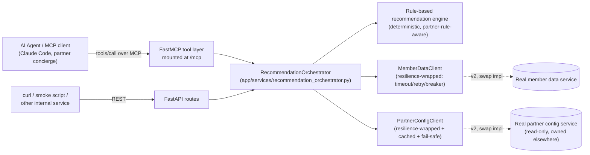
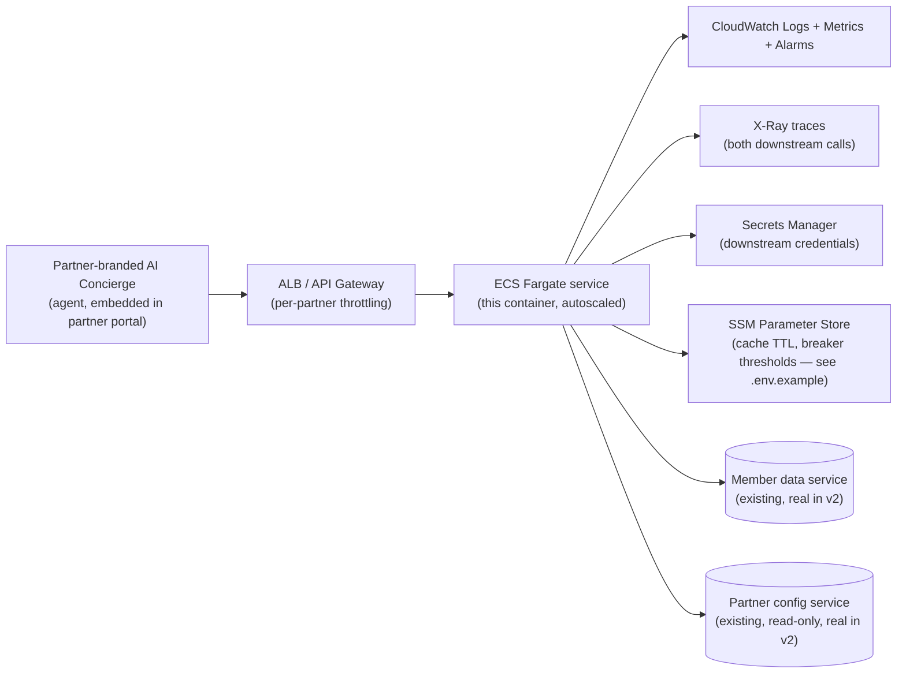

# Agentic Travel Recommendations API

An internal service that lets AI agents (via MCP) pull a member's loyalty
tier and travel history, and get back personalized, **partner-rule-compliant**
travel recommendations — the backend for a partner-embeddable "AI Concierge."

Built as a 4-week, single-engineer v1. Two mocked upstreams stand in for
services this team doesn't own: the **member data service** (read-only) and
the **partner configuration service** (read-only, hard constraint — see
`app/mocks/`). Everything else here — the rule engine, the resilience layer,
the MCP tool surface — is real, runnable code, not a sketch.

```
git clone / cd into this repo
uv venv .venv && uv pip install -p .venv -e ".[dev]"
.venv/bin/pytest -q                                   # 24 tests, ~0.7s
.venv/bin/uvicorn app.main:app --port 8000             # run it
.venv/bin/python scripts/mcp_smoke_test.py              # exercise it over MCP
```

## Contents

- [Architecture](#architecture)
- [MCP tool surface](#mcp-tool-surface)
- [Partner rule enforcement](#partner-rule-enforcement)
- [Reliability & on-call design](#reliability--on-call-design)
- [AWS deployment mapping](#aws-deployment-mapping-existing-infrastructure-only)
- [Four-week delivery plan](#four-week-delivery-plan)
- [What's explicitly out of scope](#whats-explicitly-out-of-scope-for-v1)
- [Running & verifying](#running--verifying)
- [Critical evaluation of AI-assisted development](#critical-evaluation-of-ai-assisted-development)

## Architecture

One process, two transports, one business-logic core. The MCP layer and the
REST layer are both thin wrappers around the same `RecommendationOrchestrator`
— a rule fix or a resilience fix only has to happen once, and the two
transports can never silently drift apart in behavior.



Key files:
- [`app/services/recommendation_orchestrator.py`](app/services/recommendation_orchestrator.py) — the one place request flow lives
- [`app/services/recommendation_engine.py`](app/services/recommendation_engine.py) — pure, deterministic ranking + rule enforcement
- [`app/services/member_client.py`](app/services/member_client.py) / [`partner_config_client.py`](app/services/partner_config_client.py) — the swappable interfaces over each mocked upstream
- [`app/mcp_server.py`](app/mcp_server.py) / [`app/api/routes.py`](app/api/routes.py) — the two transports

**Swapping a mock for the real service later is a one-class change**: write
e.g. `HttpMemberDataClient(MemberDataClient)` that calls the real API, wire
it in `app/dependencies.py` instead of `MockMemberDataClient`. Nothing in
the orchestrator, engine, or either transport changes.

## MCP tool surface

Three tools, all read-only by design:

| Tool | Purpose |
|---|---|
| `get_member_travel_profile(member_id)` | Loyalty tier, partner, last 5 bookings |
| `get_travel_recommendations(member_id, session_id?)` | The main tool — partner-rule-enforced, ranked recommendations with rationale |
| `list_partner_recommendation_rules(partner_id)` | The active rules for a partner, so an agent can explain *why* a list was capped or missing a category |

**No write/booking tools in v1.** A concierge agent that can only read and
recommend has a small blast radius if it's prompt-injected by untrusted
content in a chat, or simply hallucinates. "Book this for me" is a
deliberate v2 decision that needs its own authz model — see
[What's out of scope](#whats-explicitly-out-of-scope-for-v1).

Discover and call the tools yourself:

```bash
.venv/bin/uvicorn app.main:app --port 8000     # terminal 1
.venv/bin/python scripts/mcp_smoke_test.py     # terminal 2 — see below for sample output
```

## Partner rule enforcement

**The load-bearing rule: `partner_id` is always derived from the member
record returned by the member service — never accepted from caller input.**
If a client could pass `partner_id` directly, it could select a more
permissive rule set than the member's actual partner allows — a
multi-tenancy break, not just a bug. Every code path (`recommendation_orchestrator.py`)
looks up the member first and uses `member.partner_id` from there on.

Given a member and their partner's config, `build_recommendations()`
([recommendation_engine.py](app/services/recommendation_engine.py)):
1. drops any offer in the partner's `excluded_categories`,
2. drops any offer above the member's loyalty tier,
3. drops destinations the member has already booked,
4. ranks the rest by recency-weighted booking-type affinity (deterministic,
   no randomness — reproducible when debugging a partner complaint),
5. truncates to the partner's `max_recommendations` (`null` = unlimited).

The response always includes `applied_rules` (what was excluded, whether it
was capped, whether a fallback config was used) so both the REST caller and
the agent can explain the result without re-deriving it.

Sample partners in the mock data (`app/mocks/partner_configs.py`), chosen to
exercise every branch:

| partner_id | cap | excludes | member(s) to try |
|---|---|---|---|
| `suntrust-rewards` | 3 | — | `m-1001`, `m-1002`, `m-1008` (no history) |
| `globalfirst-travel` | unlimited | cruise | `m-1003` (history includes a past cruise — still filtered) |
| `meridian-points` | 1 | cruise, package | `m-1005` |
| `voyage-elite` | unlimited | — | `m-1006` |
| *(unregistered)* | — | — | `m-1007` → exercises the fail-safe fallback below |

## Reliability & on-call design

This team owns this service in production. Every choice below is about
what happens when something *else* breaks, and what on-call sees at 2am.

**Fail-safe, not fail-open, on partner rules.** The one hard constraint on
this project is "respect partner config even if suboptimal — you can't
modify it, only read it." That principle has to extend to *outages*: if we
can't reach the partner config service, or it has no record for a
`partner_id`, we must not guess permissive. `PartnerConfigClient`
(`app/services/partner_config_client.py`) resolves in this order:
1. an unexpired cached value (TTL: `ARRIVIA_PARTNER_CONFIG_CACHE_TTL_SECONDS`, default 5 min),
2. a *stale* cached value, if within `ARRIVIA_PARTNER_CONFIG_MAX_STALENESS_SECONDS` (default 15 min) — survives brief blips without over-restricting,
3. otherwise the strictest fail-safe default (`max_recommendations=1`, cruises
   and packages excluded) — never unlimited, never uncapped.

Every response built on a fallback config carries `degraded: true` so
nobody mistakes a fail-safe guess for an authoritative partner rule.

**Member service down → degrade, don't fail the request.** No member record
means no personalization signal, but the "AI Concierge" experience is worse
if it just errors. `build_generic_recommendations()` returns partner-rule-
compliant popular picks (still filtered by whatever partner rules can be
resolved) with `degraded: true, degraded_reason: "member_service_unavailable"`
— the agent can be honest with the end user about reduced personalization
instead of silently presenting a guess as tailored advice.

**Timeout + bounded retry + circuit breaker per dependency**
(`app/services/resilience.py`). A flaky partner-config lookup can't cascade
into member-data calls or exhaust the event loop retrying a dependency
that's clearly down. Business-logic exceptions (e.g. "member not found")
are explicitly marked non-retryable — they're a valid answer from a healthy
dependency and must never trip the breaker.

**`/health` vs `/ready`, deliberately different.** `/health` is liveness
only — it makes no downstream calls. A "deep" health check that pings
member data or partner config would let *their* slowness cascade into every
ECS task getting marked unhealthy and cycled simultaneously. `/ready`
exposes circuit breaker state instead, which is what alarms should actually
watch.

**Structured JSON logs**, every line carrying `request_id`, `partner_id`,
and a *hashed* `member_id` (`app/logging_config.py`) — no raw member
identifiers or PII in logs, but every line is still greppable by the three
things on-call actually searches by.

**Alarms on symptoms, not causes**: error rate, p99 latency, and
"breaker-open duration" per dependency — not "member service returned a
500," which on-call can't act on differently than the symptom anyway.

You can reproduce the failure modes locally:

```bash
# Member service "down" 100% of the time
ARRIVIA_MOCK_MEMBER_SERVICE_FAILURE_RATE=1.0 .venv/bin/uvicorn app.main:app --port 8000

curl localhost:8000/v1/recommendations/m-1001   # -> 200, degraded: true, generic picks
for i in 1 2 3 4 5; do curl -s -o /dev/null localhost:8000/v1/recommendations/m-1001; done
curl localhost:8000/ready                        # -> 503 once the breaker opens
```

That exact sequence was run against this codebase during development — the
breaker opened on the 5th consecutive failure (the configured threshold)
and `/ready` flipped to 503 immediately after, with `/health` staying `200`
throughout.

## AWS deployment mapping (existing infrastructure only)

No new infrastructure platform. Everything here is a container behind the
same AWS building blocks arrivia already runs on.



Docker image → ECR → ECS Fargate task, same CI/CD path other arrivia
services already use. `Dockerfile` runs as a non-root user and defines a
`HEALTHCHECK` against `/health` for the container-level check; ALB/ECS
target group health checks point at the same path.

## Four-week delivery plan

**Week 1 — Foundation.** Service skeleton, both mock clients behind
interfaces, data models, `/health` + `/ready`, a rule-based recommendation
engine *without* partner rules yet, unit tests, `Dockerfile`.

**Week 2 — Partner rule enforcement.** Cap + category exclusion, partner
config caching + fail-safe fallback, `partner_id`-from-member enforcement,
edge-case tests (unregistered partner, partner service down).

**Week 3 — MCP layer.** FastMCP tool definitions wrapping the same service
layer, tool schemas for discovery, timeout/retry/circuit breaker around both
mocked clients, structured logging, local smoke testing via a real MCP
client.

**Week 4 — Production hardening.** CloudWatch metrics/alarms, X-Ray hooks,
chaos-style failure testing (this README's reliability section), on-call
runbook, security pass (no PII in logs, least-privilege IAM sketch),
README/demo polish.

**Ships at the end of week 4:** REST + MCP recommendation endpoint over two
mocked upstreams, full partner rule enforcement, deterministic rule-based
ranking with rationale, timeout/retry/breaker/cache/fallback resilience,
structured logs, containerized for ECS Fargate, unit + integration tests,
an on-call-ready failure-mode story.

## What's explicitly out of scope for v1

Deferred on purpose, not by oversight:

- **Real integrations** replacing the two mocks (this is the literal next
  step in v2 — the interfaces are already shaped for it)
- **ML-based ranking** — the current engine is deliberately simple,
  deterministic, and explainable; a model can sit behind the same
  `build_recommendations()` boundary later without touching rule enforcement
- **Per-partner branded copy / white-label theming** of recommendation text
- **Click-through / feedback loop** to improve future ranking
- **Partner-portal auth (OAuth/API keys) in front of this service** — v1
  assumes it sits behind arrivia's existing internal gateway / service-to-
  service auth, not exposed directly to partner front-ends
- **Any write/booking MCP tools** — read-only is a deliberate v1 boundary,
  see [MCP tool surface](#mcp-tool-surface)
- Multi-region/active-active, an admin UI for partner config, A/B testing

## Running & verifying

```bash
# install
uv venv .venv && uv pip install -p .venv -e ".[dev]"
# (or: python3 -m venv .venv && .venv/bin/pip install -e ".[dev]")

# unit + integration tests (engine rules, resilience/breaker behavior,
# partner fail-safe fallback, MCP tool discovery + invocation)
.venv/bin/pytest -q

# run the service
.venv/bin/uvicorn app.main:app --port 8000

# REST, in another shell
curl localhost:8000/health
curl localhost:8000/v1/recommendations/m-1001

# MCP, in another shell — discovers all 3 tools and walks through every
# partner-rule scenario in the mock data (capped, unlimited+excluded,
# fail-safe fallback, cold-start, unknown member)
.venv/bin/python scripts/mcp_smoke_test.py
```

Test coverage (`tests/`): recommendation-engine rule enforcement
(`test_recommendation_engine.py`), the circuit breaker and retry semantics
in isolation (`test_resilience.py`), the partner fail-safe/caching policy
(`test_partner_rules.py`), and MCP tool discovery + invocation end to end
through an in-process session (`test_mcp_tools.py`).

## Critical evaluation of AI-assisted development

This service was built with Claude Code in an agentic loop, and it's worth
being specific about where that helped, where it didn't, and what got
double-checked rather than trusted.

- **The MCP mount path bug wasn't caught by reading the SDK, it was caught
  by running it.** Mounting `FastMCP.streamable_http_app()` at `/mcp` in
  FastAPI produced `/mcp/mcp` and a 404, because the sub-app already serves
  at its own `streamable_http_path` (default `/mcp`). The type signatures
  gave no hint of this. It only surfaced by actually starting the server and
  connecting a real MCP client — which is why this README's verification
  section runs live processes and a real client session, not just unit
  tests against in-process objects. Unit tests alone would have stayed
  green with the transport silently broken.
- **The fail-safe-fallback *direction* was a judgment call, not a default.**
  Nothing in an LLM's default instincts says "when a partner's rules are
  unreachable, assume the *strictest* interpretation, not the most
  permissive." That came from reading the constraint ("respect partner
  rules even if suboptimal") and asking what it implies about *outages*,
  not just steady-state reads. It's the single most important design
  decision in this codebase and it required stating explicitly rather than
  letting a generic "just retry and return an error" pattern happen by
  default.
- **Deliberately kept the ranking dumb.** It would have been easy to reach
  for an embeddings-based or LLM-scored ranking step. Rejected for v1
  because a rule-based, deterministic engine is something on-call can
  actually reason about at 2am ("why did member X see offer Y") without
  re-running a model — explainability was weighted above sophistication.
- **Read-only tool surface was a scope cut made explicit, not implicit.**
  It would have been just as easy to add a `book_offer` tool for a flashier
  demo. Left out deliberately — see
  [What's out of scope](#whats-explicitly-out-of-scope-for-v1) — because a
  concierge agent that can take irreversible action needs an authz model
  this 4-week v1 doesn't have time to get right.
- **Verified, not assumed, working.** Every scenario described in this
  README (partner cap, cruise exclusion, fail-safe fallback, cold-start
  member, unknown member, degraded member-service response, circuit breaker
  opening and `/ready` flipping to 503) was actually run against the running
  service during development, not just asserted in prose. `tests/` covers
  the same scenarios so they stay true as the code changes.
